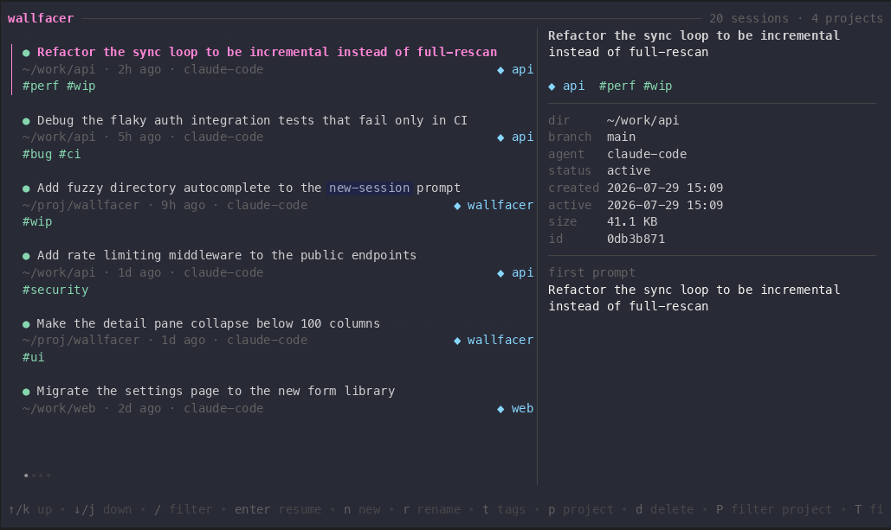

```
██╗    ██╗█████╗  ██╗     ██╗     ███████╗█████╗   ██████╗███████╗██████╗
██║    ██║██╔══██╗██║     ██║     ██╔════╝██╔══██╗██╔════╝██╔════╝██╔══██╗
██║ █╗ ██║███████║██║     ██║     █████╗  ███████║██║     █████╗  ██████╔╝
██║███╗██║██╔══██║██║     ██║     ██╔══╝  ██╔══██║██║     ██╔══╝  ██╔══██╗
╚███╔███╔╝██║  ██║███████╗███████╗██║     ██║  ██║╚██████╗███████╗██║  ██║
 ╚══╝╚══╝ ╚═╝  ╚═╝╚══════╝╚══════╝╚═╝     ╚═╝  ╚═╝ ╚═════╝╚══════╝╚═╝  ╚═╝
```

# wallfacer

A terminal session manager for [Claude Code](https://claude.com/claude-code) — see every AI coding
session you've ever started, then **name, tag, group, search, resume, or delete** them, from a
full-screen browser or straight from the command line.


## Why

Claude Code stores every conversation as an untitled JSONL file under `~/.claude/projects/`,
keyed by whatever directory you were in. After a few weeks you have dozens of transcripts you
can't tell apart and no way to find the one you need.

wallfacer indexes them all — **read-only, it never touches Claude's files** — and keeps your
titles, tags, and projects in its own local SQLite database.

## Features

- **One view of everything** — every session, from every directory, sorted by recency
- **Organize** — rename sessions, tag them, group them into projects
- **Search** — across titles, first prompts, directories, projects, and tags
- **Launch & resume** — start new sessions or jump back into old ones, from anywhere
- **Safe deletes** — `rm` moves to trash; only `--purge` is permanent
- **TUI and CLI** — a full-screen browser for humans, subcommands + `--json` for scripts
- **Extensible** — agents are pluggable adapters; Codex, opencode, Cursor CLI, and kiro-cli are on the roadmap

## Install

```bash
go install github.com/pradipta/wallfacer@latest
```

Requires Go 1.22+. Pure Go, no CGO — macOS and Linux. Pre-built binaries are on the
[releases page](https://github.com/pradipta/wallfacer/releases); building from source is
covered in the [development guide](docs/development.md).

## Two ways to use it

wallfacer is one binary with two front ends, and which one you get depends on whether you
pass a subcommand:

| You type | You get |
|----------|---------|
| `wallfacer` | **The TUI** — a full-screen, interactive session browser. Start here. |
| `wallfacer <command>` | **The CLI** — one-shot subcommands for scripts and muscle memory. |

They are not separate tools and there is nothing to switch between: both read and write the
same SQLite index, so a session you tag in the browser is immediately findable by
`wallfacer list --tag`, and vice versa. Anything the TUI can do, a subcommand can do too.

(If stdout isn't a terminal — `wallfacer | less`, or inside a script — the bare command
prints help instead of opening the browser.)

## Quick start

Open the browser and work from there:

```bash
wallfacer
```

Or drive it from the shell:

```bash
wallfacer new ~/work/api --title "Fix flaky auth tests"
wallfacer resume "fix flaky auth tests"    # by title or ID prefix
wallfacer search auth
wallfacer list --project api --json        # for scripts
```

## The TUI — `wallfacer`

Bare `wallfacer` opens a full-screen session browser: a list on the left, and a detail
pane on the right showing everything `wallfacer show` prints for whatever is highlighted.



Every row shows its project, tags, directory, age and agent — the same metadata
`wallfacer list` prints. Below ~100 columns the detail pane steps aside and the list
takes the full width.

| Key | Action |
|-----|--------|
| `↑/↓` `j/k` | move |
| `/` | fuzzy filter across titles, projects, dirs and tags |
| `P` / `T` | cycle the project / tag filter (wraps back to unfiltered) |
| `x` | clear the project and tag filters |
| `tab` | show or hide the detail pane |
| `enter` | resume — the terminal is handed to the agent; the browser returns when you exit |
| `n` | new session (prompts for directory, then title, project, tags) |
| `r` / `t` / `p` | rename / edit tags / set project |
| `d` | delete → trash, with confirmation |
| `?` / `q` | help / quit |

## The CLI — `wallfacer <command>`

Every subcommand is one-shot: it runs, prints, and exits. Same index as the browser.

| Command | What it does |
|---------|--------------|
| `wallfacer` | *(no subcommand)* Open the interactive browser |
| `wallfacer new [dir] [--title T] [--project P] [--tag t]` | Start a new session in a directory |
| `wallfacer resume <ref>` | Reopen a session in its original directory |
| `wallfacer list [--project P] [--tag T] [--json]` | List sessions, newest first |
| `wallfacer search <query>` | Search titles, prompts, dirs, projects, tags |
| `wallfacer show <ref>` | Full details of one session |
| `wallfacer rename <ref> <title>` | Rename a session |
| `wallfacer tag add\|rm <ref> <tag>…` | Add or remove tags |
| `wallfacer project set\|clear <ref>` | Group sessions into a project |
| `wallfacer rm <ref> [--purge] [-f]` | Trash a session (`--purge` deletes permanently) |
| `wallfacer sync` | Rescan disk (runs automatically before every command) |

`<ref>` is an ID prefix (`resume 5f2`) or an exact title (`resume "smoke test"`) — ambiguous
references list the candidates instead of guessing. Sessions started outside wallfacer are
picked up automatically; there's no import step.

## How it works

wallfacer scans `~/.claude/projects/`, reading just the head of each session file for its
working directory, timestamps, and first prompt (the automatic title). Your metadata lives in
SQLite at `~/.local/share/wallfacer/` — delete it and you lose only the overlay, never a
conversation. Sync is incremental, so it stays fast with hundreds of sessions.

Other agents plug in through a small adapter interface — see
[docs/adding-an-agent.md](docs/adding-an-agent.md).

## Roadmap

- [ ] Adapters for more agents: [Codex](https://github.com/openai/codex),
      [opencode](https://github.com/sst/opencode), Cursor CLI, kiro-cli
- [ ] Full-text search across session *content* (SQLite FTS5)
- [ ] `wallfacer restore` (un-trash from the CLI)
- [ ] Export a session transcript to Markdown
- [ ] Stats (sessions per project/week, disk usage)
- [ ] Desktop app — sessions in a sidebar, embedded terminal, multiple tabs
      (Wails + xterm.js on top of the same Go internals)

## Contributing

See the [development guide](docs/development.md) for building, testing, and releasing.
Contributions welcome — especially new agent adapters.

## License

[MIT](LICENSE)

---

*The name is borrowed from the Wallfacers of Liu Cixin's* The Dark Forest *— people entrusted
with plans too sprawling for anyone else to follow.*
